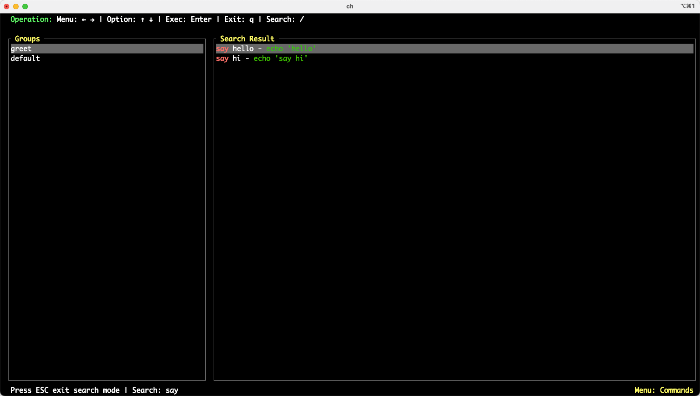

# ch - Command Manager TUI

A terminal user interface (TUI) application for managing and executing custom shell commands, organized by groups. Built with Rust, using the `tui` and `crossterm` libraries.



## Features
- Organize commands into groups for easy access
- Fuzzy search and filter commands
- Execute shell commands directly from the TUI
- Keyboard navigation for fast operation
- Configurable via a simple TOML file

## Installation

1. **Clone the repository:**
   ```sh
   git clone <repo-url>
   cd ch
   ```
2. **Build the project:**
   ```sh
   cargo build --release
   ```
3. **(Optional) Install globally (to your user's cargo bin directory):**
   ```sh
   cargo install --path .
   ```
   This will install the binary to `$HOME/.cargo/bin/ch`.
   Make sure `$HOME/.cargo/bin` is in your `PATH`:
   ```sh
   export PATH="$HOME/.cargo/bin:$PATH"
   ```
   Now you can run:
   ```sh
   ch
   ```
   If you encounter a "command not found" error, ensure that `$HOME/.cargo/bin` is in your `PATH`.

## Usage

Run the application:
```sh
cargo run --release
```
Or, if installed:
```sh
ch
```

You can specify a custom config file:
```sh
ch -c /path/to/config.toml
```
If not specified, the default config path is `~/.ch/config.toml`.

## Configuration

Commands and groups are defined in a TOML file. Example:

```toml
[groups]

[groups.default]
connections = { "hello~~~~" = "echo 'Hello World'" }

[groups.test]
connections = { "testi_command" = "echo 'This is a test command'", "ls" = "ls -la" }

[groups.database]
connections = { "test_mysql" = "mysql", "goto" = "ssh user@remote-db-server" }
```
- Each group can have multiple commands (key = label, value = shell command).

## Keybindings

- `←` / `→` : Switch between group and command panels
- `↑` / `↓` : Move selection up/down
- `Enter`   : Execute the selected command
- `q`       : Quit the application
- `/`       : Enter search mode
- `ESC`     : Exit search mode

## License

MIT
